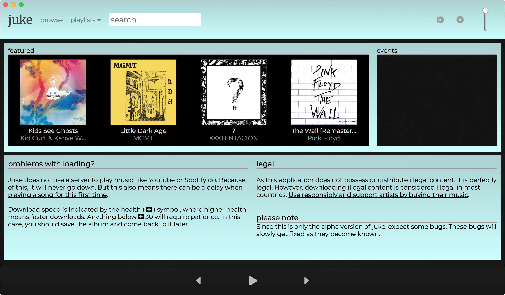
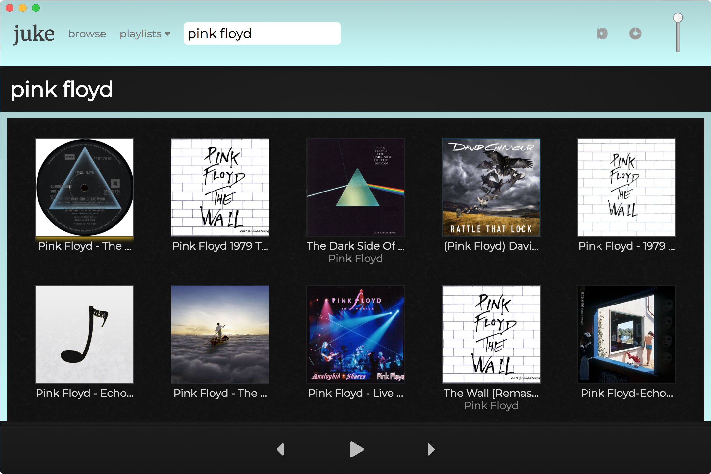
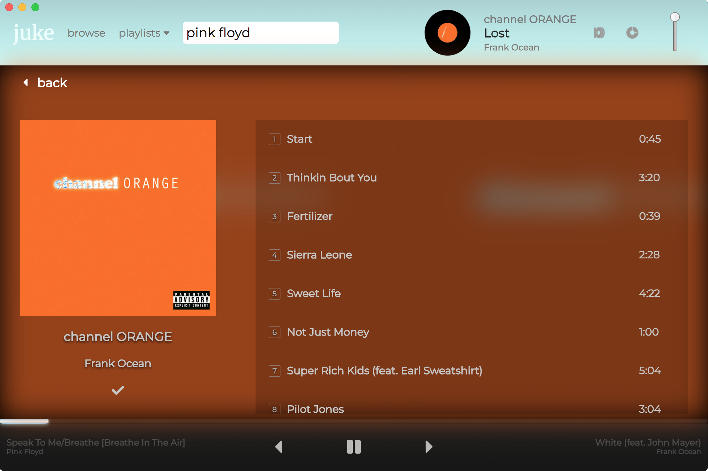

# juke
torrent music streaming app (prototype)



*At the moment, juke is in its infancy. The current code is not optimized yet, but will gradually become so as I get time to update, or others contribute to cleaning up the code.*

juke is  music torrent streamer and downloader - like Spotify for the pirate bay.

*This was made for demo purposes only. Please support artists and the music industry.*

## Usage
```javascript
git clone https://github.com/sinclairnick/juke.git
cd juke
npm start
```

---

Short-term to-do list:
* implement promise cancellation on playing music
* convert css to sass (and generally clean up stylesheets
* remove duplicates from search results
* enable renaming playlists
* optimize cached song downloads and de-cluttering storage

Long-term to-do list:
* Set up database functionality for cloud-based playlists, libraries and improved search/metadata capabilities

---

## More Images:

### Saved Albums


### Search Results


### Selected Album
